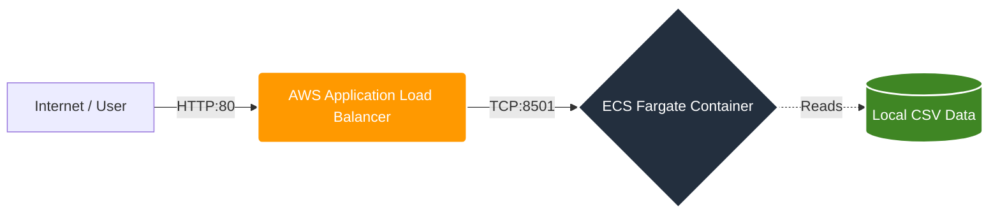
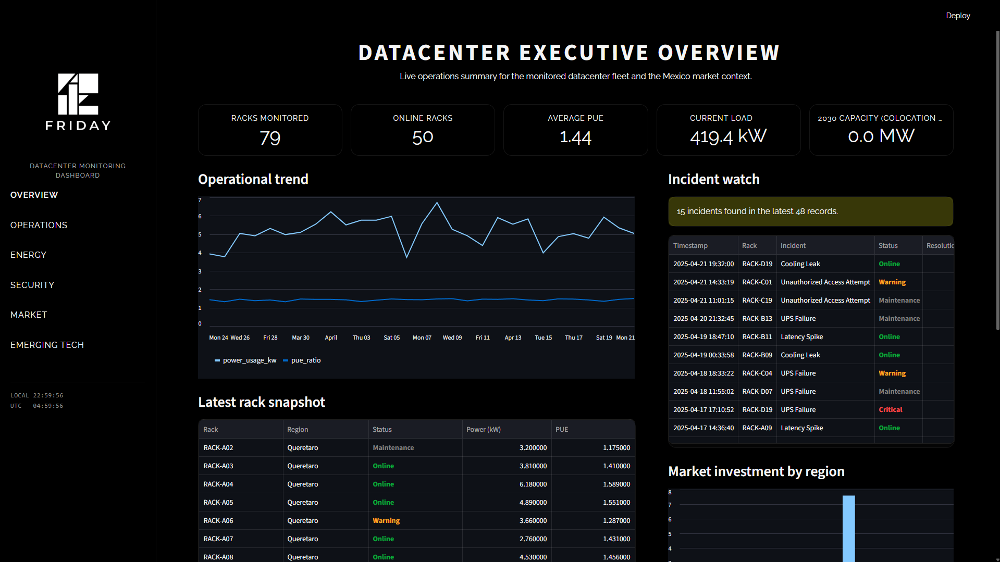
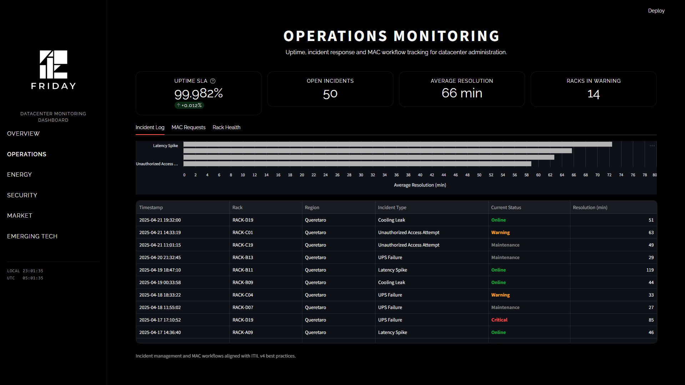
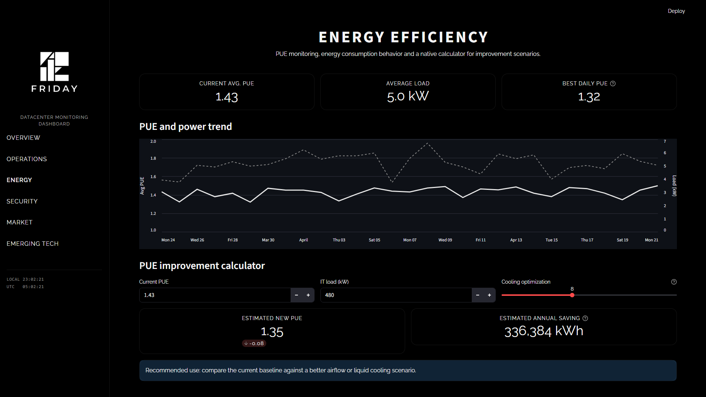
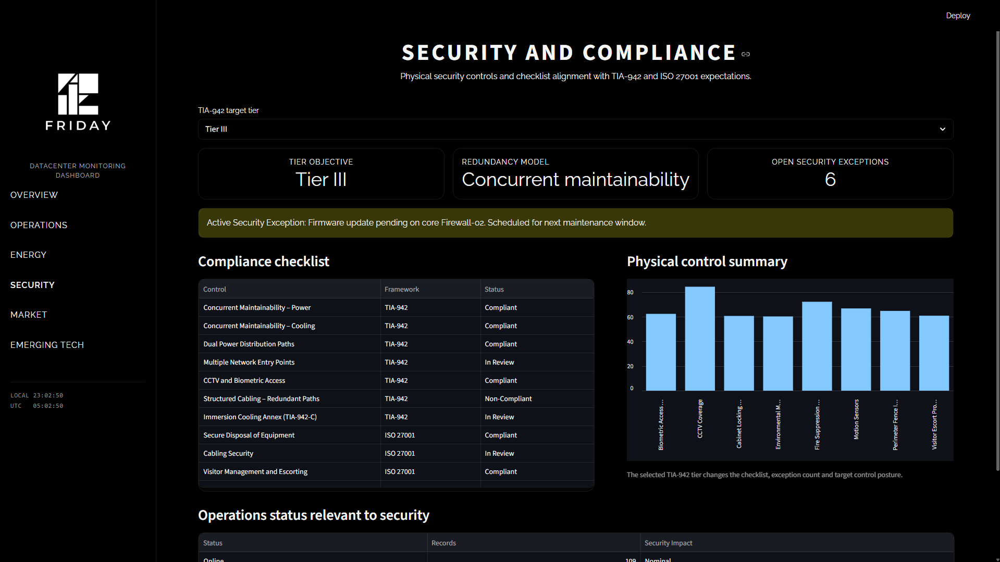
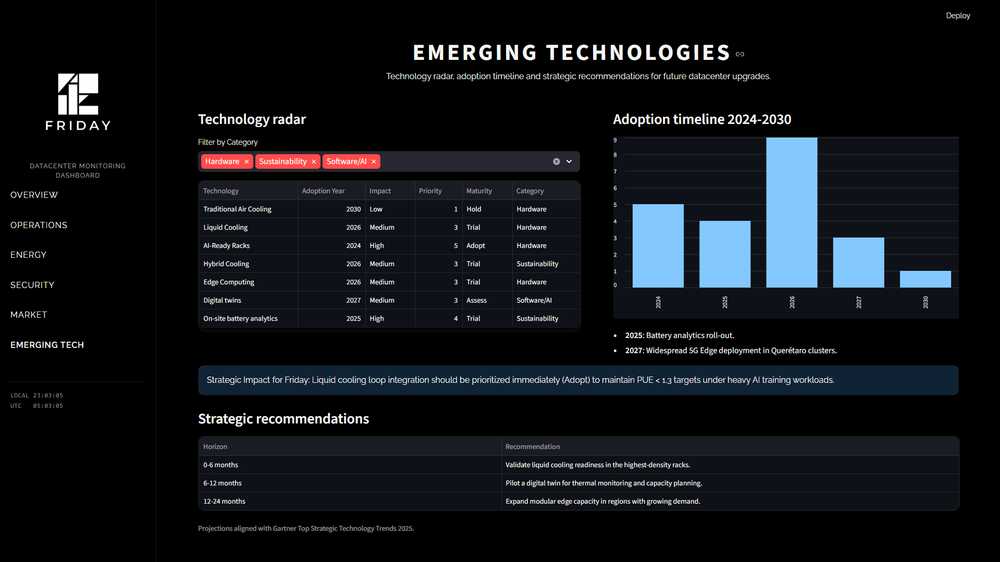

# Friday: Datacenter Monitoring Dashboard


Friday is a high-performance, data-driven SaaS dashboard designed for advanced datacenter operations management. Built specifically for the Mexican market context, it provides real-time insights into fleet health, energy efficiency (PUE), security compliance, and market trends.

## Technology Stack

- **Frontend/Logic:** [Streamlit](https://streamlit.io/) (Python)
- **Containerization:** [Docker](https://www.docker.com/) & Docker Compose
- **Infrastructure as Code:** [Terraform](https://www.terraform.io/)
- **Cloud Provider:** [AWS (ECS Fargate)](https://aws.amazon.com/fargate/)
- **CI/CD:** [GitHub Actions](https://github.com/features/actions)

## Cloud Architecture



### Why Stateless?

The project follows a **Stateless Architecture** approach for its deployment on AWS Fargate. Key benefits include:

1. **Cost Optimization (90% Reduction):** The use of `.csv` files integrated directly into the Docker image, instead of an external persistent database (like AWS RDS PostgreSQL), reduces the operational database costs to exactly $0 while maintaining high availability. This provides an estimated 90% reduction in overall infrastructure costs for a read-heavy dashboard.
2. **Horizontal Scalability:** Being stateless, the application can scale across multiple Fargate tasks effortlessly without worrying about database connection limits or state synchronization.
3. **Portability:** The entire environment is encapsulated within a Docker image, ensuring "it works on my machine" translates perfectly to "it works in production."
4. **Fast Deployment:** Reduced infrastructure complexity leads to faster CI/CD pipelines and simpler disaster recovery.

## 🛠️ Local Development

To run the project locally using Docker:

```bash
# Build and start the container
docker-compose up --build -d

# Access the dashboard
# http://localhost:8501
```

## ☁️ Deployment Instructions

### 1. Infrastructure Provisioning (Terraform)

The infrastructure is defined in the `/infra` directory.

1.  Navigate to the infra folder: `cd infra`
2.  Initialize Terraform: `terraform init`
3.  Review the execution plan: `terraform plan`
4.  Apply changes: `terraform apply`

*Note: Ensure you have your AWS credentials configured and a `terraform.tfvars` file (if necessary) before applying.*

### 2. CI/CD with GitHub Actions

Once the infrastructure is ready (specifically the ECR repository), the deployment is automated:

1.  **Secrets Configuration:** Add `AWS_ACCESS_KEY_ID` and `AWS_SECRET_ACCESS_KEY` to your GitHub Repository Secrets.
2.  **Push to Main:** Any push to the `main` branch triggers the `.github/workflows/deploy.yml` workflow.
3.  **Automatic Update:**
    - The action builds the new Docker image.
    - Pushes the image to **Amazon ECR**.
    - Triggers a **force-new-deployment** on the **ECS Fargate** service to pull the latest image.

---


Overview page example


Operations page example


Energy page example


Security page example


Emerging Technologies page example

---

**Academic Project:** E-CED-2 | Friday Datacenter Intelligence.
**Dataset Source:** [Mexico Data Centers 2025 (Kaggle)](https://www.kaggle.com/datasets/jorgeenriquevp/mexico-data-centers-2025)
