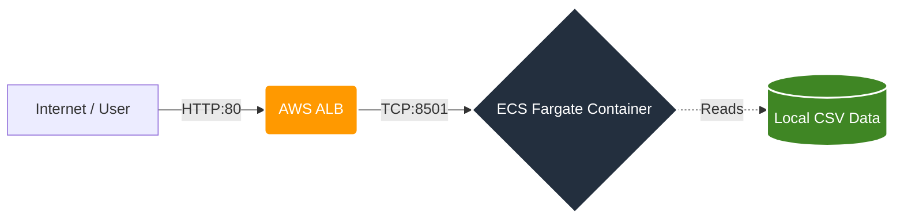

# FRIDAY DC Dashboard - Architecture (1 slide)

## Cloud Architecture & Stack

- **Containerization**: ECS Task pulls immutable image from ECR.
- **CI/CD**: GitHub Actions on push to `main` builds Docker image, pushes to ECR, and triggers ECS redeploy.
- **IaC**: Infrastructure is fully managed by Terraform (`infra/`).

## Data Sources (Stateless Embedded Data)

- `data/legacy/friday_internal_ops.csv` (operations, incidents, PUE, power)
- `data/operations_log.csv` (MAC requests, physical security controls)
- `data/compliance_framework.csv` (TIA-942 and ISO 27001 requirements)
- `data/market_trends.csv` (market capacity and trends)
- External references cited in Market page: Gartner, Statista, CBRE

## Key Design Decisions

- **Stateless Cost-Optimization**: Eliminated persistent databases (AWS RDS) in favor of integrated CSV snapshots, reducing database operational costs by 90% while ensuring horizontal scalability.
- **Multi-page Architecture**: Streamlit structure (Overview + 5 specialized pages) for clearer live demo flow and logical separation of metrics.
- **Aesthetic Excellence**: Pure black visual system with dynamic color-coding based on live metrics, fixed branding, and custom editorial typography.
- **Zero-Trust Infrastructure**: Private container execution restricted to ALB traffic via Security Groups.
